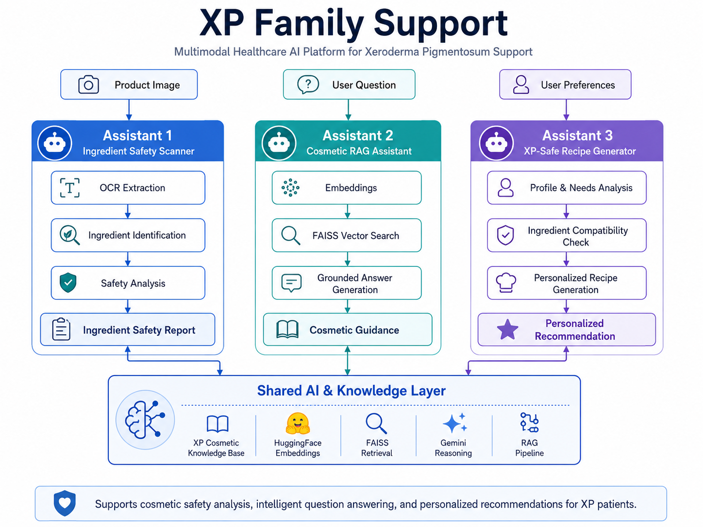

# 🧬 XP Family Support

### Multimodal Healthcare AI Platform for Xeroderma Pigmentosum Support

XP Family Support is an AI-powered healthcare platform designed to support
Xeroderma Pigmentosum patients and families through cosmetic safety analysis,
medical information retrieval and personalized recommendations.

The platform combines OCR, Retrieval-Augmented Generation, multimodal AI and
personalized recommendation workflows.

---

## 🚀 Core Assistants

### 🧴 Assistant 1 — Ingredient Safety Scanner

Analyzes cosmetic product images using OCR and extracts ingredient information
for safety assessment.

**Main capabilities:**
- Cosmetic product image upload
- OCR-based ingredient extraction
- Ingredient identification
- RAG-based analysis
- XP-oriented cosmetic safety assessment

---

### 💬 Assistant 2 — Cosmetic RAG Assistant

Interactive AI assistant designed to answer questions related to cosmetic
ingredients and product safety.

**Main capabilities:**
- Natural-language questions
- Semantic retrieval
- FAISS-based vector search
- Context-grounded generation
- Cosmetic knowledge assistance

---

### 🧪 Assistant 3 — Personalized XP-Safe Recipe Generator

Generates personalized cosmetic recommendations and recipes while considering
ingredient compatibility and XP-related constraints.

**Main capabilities:**
- Personalized cosmetic recommendations
- Ingredient analysis
- AI-assisted recipe generation
- Knowledge-grounded responses
- XP-oriented safety support

---

## 🧠 System Architecture

<p align="center">
  
</p>

The platform is organized around three specialized assistants that share
AI-powered retrieval and reasoning capabilities.

---

## 🔄 AI Workflow

```text
                         XP FAMILY SUPPORT
                                │
             ┌──────────────────┼──────────────────┐
             │                  │                  │
             ▼                  ▼                  ▼

      ┌─────────────┐    ┌─────────────┐    ┌─────────────┐
      │ Assistant 1 │    │ Assistant 2 │    │ Assistant 3 │
      │ Ingredient  │    │ Cosmetic    │    │ Personalized│
      │ Scanner     │    │ RAG         │    │ Recipe      │
      └──────┬──────┘    └──────┬──────┘    └──────┬──────┘
             │                  │                  │
             ▼                  ▼                  ▼
            OCR             User Query       User Profile /
             │                  │             Preferences
             ▼                  ▼                  │
      Ingredient Text      Embeddings              │
             │                  │                  │
             └───────────┬──────┴───────────┬──────┘
                         │                  │
                         ▼                  ▼
                    Vector Search      Knowledge Layer
                         │                  │
                         └─────────┬────────┘
                                   ▼
                           RAG / AI Reasoning
                                   │
                                   ▼
                         Personalized Response
